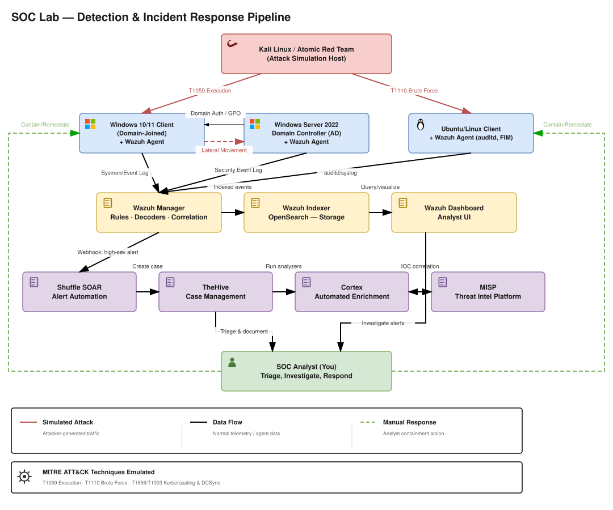

# soc-lab

A dedicated SOC lab environment, network-segmented from my general homelab, simulating attacks and detecting them through a full alert-to-response pipeline.

## Why I Built This

I'm building practical SOC Analyst skills, and standing up tools is only the starting point. This lab is where I practice detection engineering, alert triage, and incident response workflows: simulating an attack, writing the detection, and taking the alert through enrichment to a documented case. Each build is documented here as a record of what I can actually do.

The editable `.drawio` source is also in [`/diagrams`](diagrams).

## Stack

**Attack simulation**
- Kali Linux / Atomic Red Team

**Endpoints**
- Windows 10/11 client (Wazuh agent, Sysmon + FIM)
- Ubuntu/Linux client (Wazuh agent, auditd + FIM)

**Domain controller**
- Windows Server 2022 Domain Controller (AD attack detection — Kerberoasting, DCSync — MITRE ATT&CK T1558/T1003)

**Detection**
- Wazuh (3-tier — Manager, Indexer, Dashboard)

**Automation**
- Shuffle (webhooks high-severity alerts into TheHive)

**Case management**
- TheHive

**Enrichment**
- Cortex (observable analyzers, cross-references MISP)

**Threat intel**
- MISP

## Planned Additions

Observability and log aggregation layer:

- Loki
- Grafana
- Graylog

## Architecture

This lab runs on its own dedicated VLAN, isolated from the general homelab network. MITRE ATT&CK techniques emulated: T1059 (Execution), T1110 (Brute Force), T1558/T1003 (Kerberoasting & DCSync).

## Related Tooling

Network-edge IDS (Snort/Suricata) lives in the general homelab's networking layer, not in this repo, but can optionally forward alerts into Wazuh as an additional log source.

## Repository Structure

| Folder | Contents |
| --- | --- |
| `/wazuh` | Wazuh manager, indexer, and dashboard: agent deployment, custom rules and decoders, and alerting configs |
| `/thehive` | TheHive case management: setup, Wazuh/Shuffle integration, and incident response workflows |
| `/cortex` | Cortex analyzers: observable enrichment setup and MISP cross-referencing |
| `/misp` | MISP threat intelligence platform: setup, feeds, and integrations |
| `/shuffle` | Shuffle automation: workflows and webhooks that route high-severity alerts into TheHive |
| `/active-directory` | Windows Server 2022 domain controller and attack detection (Kerberoasting, DCSync) |
| `/diagrams` | Architecture and detection pipeline diagrams (SVG and editable `.drawio` source) |
